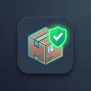

<p align="center">
  
</p>

<h1 align="center">Package Pre-Flight</h1>

<p align="center">
  Catch the project and platform problems that would fail your Unreal Engine cook/package build — <b>before</b> you wait for the build.
</p>

---

Package Pre-Flight is an **editor-only** Unreal Engine plugin. One click runs a battery of fast,
read-only checks against your project and the target platform, then shows a severity-ranked list of
what would break the build — each with a one-line fix and a jump straight to the Project Settings page
that fixes it. No more waiting 30 minutes for an Android package only to hit a keystore error, fixing
it, and waiting again.

> Editor-only. It never modifies your assets. Supported: **Unreal Engine 5.8** (Win64 editor).

## How to use

1. Click **Pre-Flight ▾** on the main toolbar (next to Play), or open **Tools → Package Pre-Flight**.
2. Pick a **Target platform** (Android / iOS / Windows / General).
3. Click **Run Pre-Flight**.
4. Read the verdict. Use **Open Settings** on any finding to jump to the fix, or **Copy Report** to share it.

The toolbar **Pre-Flight ▾** dropdown also has a one-click **Check before packaging** per platform, with a
go / no-go dialog.

### From the console / CI

```
PackagePreflight.Run Android
```

```
UnrealEditor-Cmd "MyProject.uproject" -ExecCmds="PackagePreflight.Run Android, Quit" -unattended -nosplash -stdout
```

## What it checks

**General (always run)**
- Game Default Map is set and the map asset exists.
- Project Name / Company / Version are filled in.
- Unresolved redirectors in `/Game`.
- Oversized source assets (> 100 MB).
- Enabled project plugins whose runtime modules are not allow-listed for the target platform.

**Android**
- Android platform support is installed in this engine.
- The Android SDK, NDK and JDK are present (checked via env vars, Android SDK settings, and the default install).
- Package name is not the default `com.YourCompany.[PROJECT]`.
- Target SDK meets the current Google Play minimum.
- A signing keystore exists under `Build/Android` for Shipping / store builds.
- A graphics API (Vulkan and/or OpenGL ES3.1) is enabled.

**Windows**
- For a C++ project, a Visual Studio C++ (MSVC) toolchain and a Windows SDK are installed.

**iOS**
- You are on a host that can build iOS (macOS / a configured remote Mac — not Windows alone).
- Bundle Identifier is not the default.

Findings are ranked **Blocker → Warning → Info → Pass**. Blockers mean the build will fail.

## Notes

Package Pre-Flight catches the common, statically-detectable failures — a fast pre-flight, not a guarantee
that every cook will succeed. The check catalog grows with each release.

## Support

Open an [issue](https://github.com/badbadgerentertainment-hue/Package-Preflight/issues) (include your Unreal Engine version and steps).

## License

Copyright © 2026 JMPingvin. All Rights Reserved.
